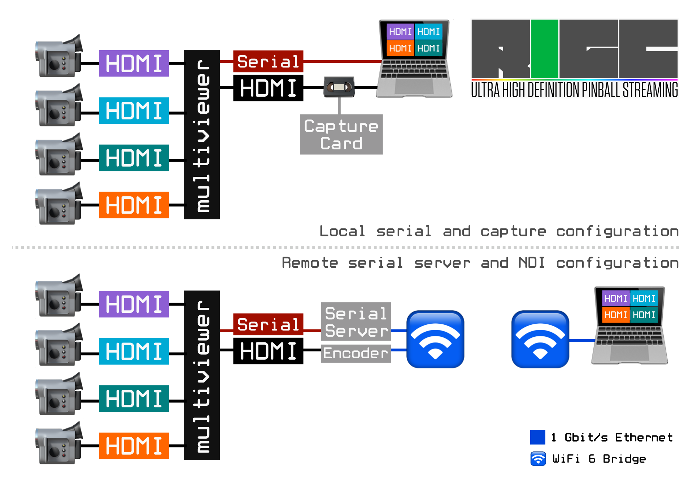
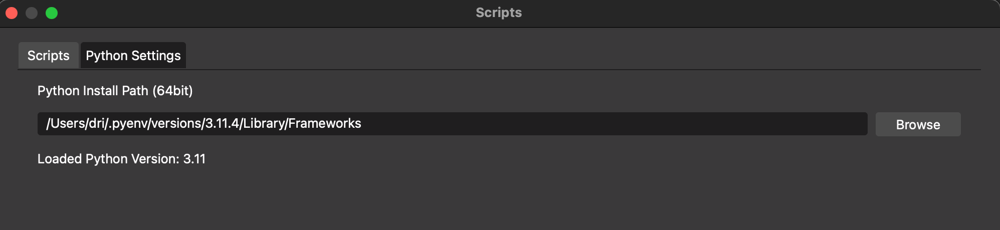
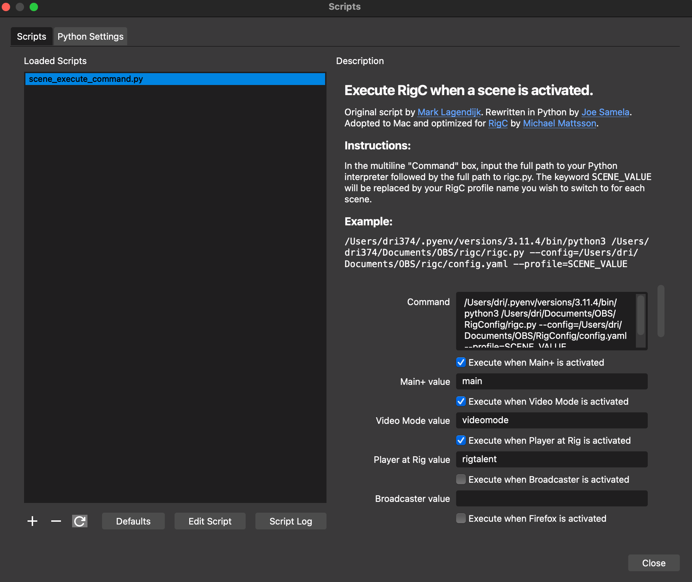

# RigC

RigC (pronounced Rigsy) is a set of Python scripts and modules to configure an NDI encoder and a multiviewer. RigC is meant to be strapped into OBS and apply a configuration for the two devices when a broadcaster switch scenes. Many of the parameters of the two devices are supported for configuring the stream and may run locally over a serial port or a remote socket on a serial gateway. Why RigC? See the [background](#background) story.

🛑 **MacOS Seqoia 15.0 to 15.2 and potential future updates:** Local serial port open/close is super slow. This makes RigC unusable in local serial port mode during live production. Configuring the multiviewer as a one off with RigC is fine. Monitor this thread for updates: https://discussions.apple.com/thread/255763367

Using RigC with an Ethernet-to-Serial device works fine as RigC just uses TCP/IP for communication with the multiviewer.

## Synopsis

The `rigc.py` script is supposed to be embedded in OBS. See the [installation](#installation) section. There's a CLI to help iterate faster on profile configurations.

```
./cli.py --help
Usage: cli.py [OPTIONS]

Options:
  --config PATH   config.yaml formatted file
  --profile TEXT  Profile name in --config
  --mbps INTEGER  Throttle encoder bitrate to Mbit/s, overrides bitrate in
                  `encoder` sections in --config. Use with caution.
  --baseline      Apply multiviewer baseline configuration suitable for
                  streaming.
  --debug         Turn on very verbose logging and override --config flag.
  --help          Show this message and exit.
```

Example configuration file.

```yaml
# Orei multiviewer commands
# https://cdn.shopify.com/s/files/1/1988/4253/files/UHD-401MV-Updated_User_Manual.pdf?v=1672745852

# Magewell encoder API
# https://www.magewell.com/api-docs/pro-convert-encoder-api/
---
config:
  local:
    # If serial_port can't be found, the .config.mv.ip_addr will be used
    serial_port: /dev/cu.usbserial-3
    # Set to true to ignore encoder and encoder sections
    ignore_encoder: false
    # Do not set to true in production
    debug: false
  mv:
    # Set your preferences
    ip_addr: 192.168.37.5
    # run `./cli.py --baseline --config config.yaml` to apply baseline on a new
    # unit, like disabling HDCP, OSD, auto-switching and window borders.
    # vka sets the background color when applying the baseline config
    vka: blue # video keep active pattern, blue or black.

    # tunables
    remote_timeout: 2.0  # Positive float timeout in seconds for IP-based command
                         # If null is given, the socket is put in blocking mode
    command_delay: .1    # Positive float delay after sending a MV command
                         # Tune this if timeouts are being hit on quad layouts

  # All encoder sections are optional if you don't have a compatible encoder.
  encoder:
    ip_addr: 192.168.37.4
    user: Admin
    # md5 of your password (this is Admin)
    pass: e3afed0047b08059d0fada10f400c1e5
profiles:
  main:
    mv:
      # Keyed from with config.mv.scenes
      scene: quad
      # Keyed from with config.mv.modes
      output: 3840x2160p60
      # Consume key (HDMI input) and put in value (Multi-Viewer viewport)
      layout:
        HDMI-1: 1
        HDMI-2: 2
        HDMI-3: 3
        HDMI-4: 4
      audio: 3
    encoder:
      # 50 - 200 "quality" slider, default is 100, ignored when --mbps is used
      bitrate: 100 
      # frame rate, raw matches input, half, one-third, quarter are valid
      framerate: raw
      # 1920x1080 etc, raw means match input
      resolution: raw
  player:
    mv:
      # Keyed from with config.mv.scenes
      scene: single
      # Keyed from with config.mv.modes
      output: 3840x2160p60
      # Consume key (HDMI input) with value (viewport output)
      layout:
        HDMI-2: 1
      audio: 3
    encoder:
      # 50 - 200
      bitrate: 200
      # frame rate, raw matches input, half, one-third, quarter are valid
      framerate: raw
      # 1920x1080 etc, raw means match input
      resolution: 1920x1080
  playfield:
    mv:
      # Keyed from with config.mv.scenes
      scene: pip
      # Keyed from with config.mv.modes
      output: 3840x2160p60
      # Consume key (HDMI input) with value (viewport output)
      layout:
        HDMI-4: 1 # bottom input
        HDMI-2: 2 # inlay input
      audio: 3
      pip: # percentages
        size: 25
        pos-x: 2
        pos-y: 3
    encoder:
      # 50 - 200 "quality" slider, default is 100, ignored when --mbps is used
      bitrate: 200
      # frame rate, raw matches input, half, one-third, quarter are valid
      framerate: raw
      # 1920x1080 etc, raw means match input
      resolution: raw
```

## Prequisites and Hardware SKUs

RigC has been developed on a Mac and will most likely just work on Mac and Linux at this time.

- Python scripting needs to be activated in OBS (find instructions for this elsewhere).
- HDCP needs to be disabled on the multiviewer prior use with a capture card.

RigC now allows baseline configuration of a brand new multiviewer. It will disable HDCP and set other useful defaults.

```
./cli.py --baseline --config config.yaml --debug
```

### Tested (and should work) Hardware

Reports of devices working with RigC are welcomed.

#### Multiviewers

These share the same MCU on paper.

- OREI UHD-401MV (Works 100%)
- Monoprice Blackbird Pro Series 4K60 Multiviewer (not tested)
- NEUVIDEO 4x1 4K60 UHD Quad/PiP/PoP Multiviewer (not tested)

It's recommended to make sure the latest firmware of the MCU and scaler is installed. The latest version of RigC is tested against:

```
MCU FW version 1.00.12
SCALER FW version 20240328-11
```

#### Serial servers

Any serial server that expose the serial interface over Telnet (port 23) should work.

These are the ones I've gone through.

- PUSR USR-TCP232-410s
  - This device puts itself to sleep and needs a perpetual `ping` against it to keep it alive. I have a support ticket open asking for a firmware update etc.
- StarTech NETRS2321P (discontinued, see next)
  - Works out of the box without any configuration except setting an IP address.
- StarTech I13-SERIAL-ETHERNET
  - Set IP addrass and serial to 115200-8-N-1-N. Run as "TCP Server" on port 23. 

**Tip:** If you're looking for a quick and dirty solution to just run a few commands on the multiviewer, check out [CoolTerm](https://coolterm.macupdate.com/). It works for both local and remote serial interfaces and great for debugging.

#### Encoders

Magewell Pro Converters all have the same API. The Ultra Encode series would need work.

- Magewell Pro Convert HDMI 4K Plus (Works 100%)
- Magewell Pro Convert HDMI Plus
- Magewell Pro Convert HDMI TX
- Magewell Pro Convert 12G SDI 4K Plus
- Magewell Pro Convert SDI 4K Plus
- Magewell Pro Convert SDI Plus
- Magewell Pro Convert SDI TX

**Note:** RigC does NOT require an NDI encoder to operate.

## Marketecture



Using the serial interface is optional and RigC can configure a quad or triple view as a set-it-and-forget-it on the multiviewer. The output may be captured by either an encoder remotely or HDMI locally. In such configuration, RigC does not even need to be installed into OBS and can merely be used as a multiviewer configuration tool.

## Demos

A short snippet that describes the benefit of using 4K cameras in single view modes.

[](https://youtu.be/PLqVQgK3UIY)

<!--
## Demonstration

I used a somewhat dull and blank setup for illustration purposes. But it captures the intent and capabilities of RigC.

### Using RigC in a remote configuration.

[](https://youtu.be/ID)

### Using RigC in a local configuration.

[](https://youtu.be/ID)

-->

## Configuring Profiles

The provided configuration example should be self-explanatory. Copy `config.yaml-dist` to a new file and load it up in OBS.

This section is work in progress.

## Installation

It's recommended to install a new Python virtual environment.

```
env PYTHON_CONFIGURE_OPTS="--enable-framework" pyenv install 3.11.4
export PATH=~/.pyenv/versions/3.11.4/bin:${PATH}
```

Clone this repo into a directory accessible by OBS.

```
git clone http://github.com/datamattsson/rigc
cd rigc
pip install -y requirements.txt
# (Optional) check to see if RigC will compile in your Python environment
find . -name '*.py' | xargs python -m py_compile
```

## OBS Setup

Go to `Tools -> Scripts -> Python Settings`, select the Python virtual environment prescribed above.



Next, hit that `+` sign and find `rigc.py` in the `rigc` repository.



# Bugs and Help

Please use [issues](/issues) to report potential issues and ask questions.

## Known Issues and Limitations

Major annoyances and workarounds.

- RigC is inserted synchronously after the scene transition and needs to return an exit code to OBS before becomes usable again. Under normal circumstances this takes less then half a second and is not noticeable by the broadcaster. You will get the spinning beach ball that will eventually freeze the program until RigC times out. Asynchronous execution is on the roadmap for RigC. See also: Next bullet.
- Do NOT run RigC with `--debug` enabled in production. In certain circumstances the serial port read operation gets stuck and takes up to a minute to timeout. Since the OBS script is synchronous, the program will be impacted after a few seconds. Without `--debug`, the serial port is never read, only written to.
- Do NOT run RigC with `--mbps` enabled in production. It's highly volatile and may lock up OBS if configured inappropriately. 
- Make sure you have the latest firmware installed for your devices. Contact the vendor to ensure your device is updated, this includes both the encoder and multiviewer.
- Since RigC is inserted AFTER the scene transition the program will see some ugly switching for around half a second. To cover up this, I'm using "Image Slideshows" with an animated GIF that substitutes the scene transition as it runs immediately BEFORE the scene transition and smooths over the switching.
- OBS keeps the names of profiles in the configuration pane dropdowns. If you're switching different configuration files for different purposes, make sure the profile names overlap otherwise you'll lose the dropdown selections. I learned this the hard way.

# Background

In the world of pinball streaming you are dependent of having at least three cameras capturing talent, playfield and score boards wirelessly in a very confined space. A multiviewer is a great device to ingest HDMI signals and output a "grid" of inputs to OBS. The principal caveat of using such a solution is that the input will be a quarter of the original resolution and there is some loss of quality when working with 1080p60 if scaling is involved (I.e stretching 960 to 1080 for the playfield camera). The most common adapted solution is to run one wireless HDMI transmitter/receiver pair per camera but it comes with its own set of challenges.

The idea of RigC came from both the limitations and possibilities of the Magewell Director Mini. A need to have a remotely controlled multiviewer with 2160p60 capabilities and by using an NDI encoder, those needs could be met. It gives the operator very granular control over bitrate, framerate and resolutions when bandwidth is scarce and yield superior quality when there's an abundance of bandwidth.

Running full NDI over WiFi is considered by industry professionals the dumbest idea ever but tests have shown that the Magewell encoder may encode at 550Mbit/s on WiFi6 when the air is good. Full NDI 2160p60 is advertised at 250Mbit/s but the Magewell encoder have a bitrate slider to increase the quality for the cost of bandwidth. Since the WiFi is isolated and only run a single NDI stream, it's less of an issue with congestion. Further, you can throw any WiFi bridge solution on this problem, less so with a purpose built HDMI transmitter/receiver.

A purpose built 2160p60 wireless HDMI transmitter/receiver product from Teradek cost $6,490 last time I checked. RigC is the solution until competition has caught up with Teradek to make 2160p60 wireless affordable and feasible for pinball streaming, RigC costs about a third and is way more flexible than a dedicated 2160p60 transmitter/receiver.

**Edit 2024-12-28**: Accsoon have released an affordable 2160p60 transmitter/receiver ([CineView Master 4K](https://accsoonusa.com/page/cineview-4k/)) that retails for around $900 with the meager bandwidth of 12Mbit/s and it's nowhere near where it needs to be for high definition tournament pinball streaming using a multiviewer.

# License, Contribute and Support RigC

RigC is available under the [MIT](LICENSE) license.

Contributions to this repository are welcomed.

You can support this project by visiting [linktr.ee/dri374](https://linktr.ee/dri374) and get some schwag from the shop or donate through Patreon or PayPal.

Copyright 2024 Michael Mattsson. Derived work of [josephsamela/obs-scene-execute-command-scripts](https://github.com/josephsamela/obs-scene-execute-command-script/). Copyright 2022 Joe Samela.
