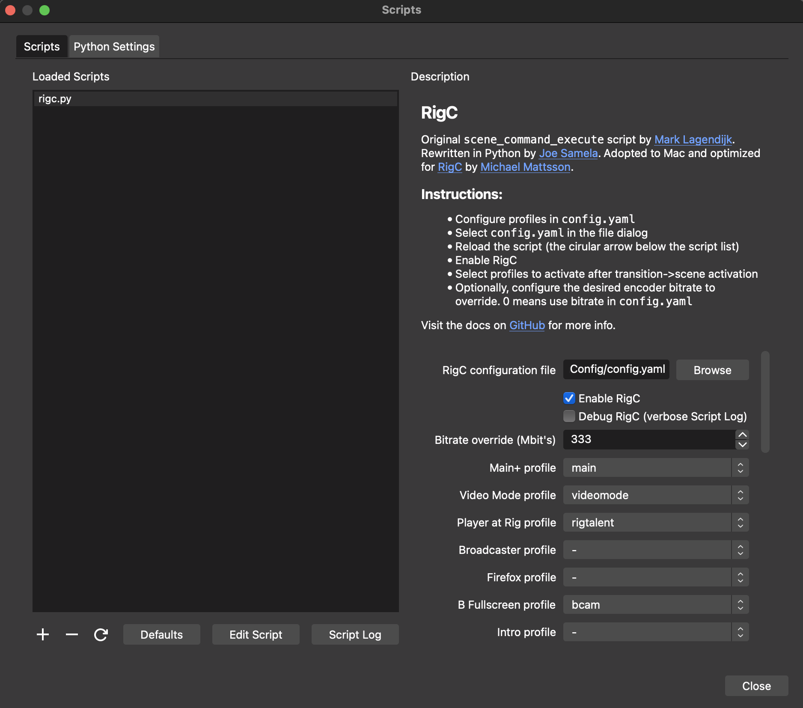

# RigC

RigC (pronounced Rigsy) is a set of Python scripts and modules to configure an NDI encoder and a multiviewer. RigC is meant to be strapped into OBS and apply a configuration for the two devices when a broadcaster switch scenes. Many of the parameters of the two devices are supported for configuring the stream and may run locally over a serial port or a remote socket on a serial gateway. Why RigC? See the [background](#background) story.

## Synopsis

The `rigc.py` script is supposed to be embedded in OBS. See the [installation](#installation) section. There's a CLI to help iterate faster on profile configurations.

```
./rigcli.py --help
Usage: rigc.py [OPTIONS]

Options:
  --config PATH   config.yaml formatted file
  --profile TEXT  Profile name in --config
  --mbps INTEGER  Throttle encoder bitrate to Mbit/s, overrides bitrate in
                  `encoder` sections in --config. Use with caution.
  --help          Show this message and exit.
```

Example configuration file.

```
# Orei multi-viewer commands
# https://cdn.shopify.com/s/files/1/1988/4253/files/UHD-401MV-Updated_User_Manual.pdf?v=1672745852

# Magewell encoder API
# https://www.magewell.com/api-docs/pro-convert-encoder-api/
---
config:
  local:
    serial_port: /dev/cu.usbserial-3
    # set to true to ignore encoder when local serial is connected
    ignore_encoder: true
    debug: true
  mv:
    ip_addr: 192.168.37.5
    modes:
      3840x2160p60: 3
      3840x2160p30: 5
      1920x1080p60: 8
    scenes:
      single: 1
      pip: 2 # Not tested
      pbp: 3 # Not tested
      triple: 4
      quad: 5
  encoder:
    ip_addr: 192.168.37.4
    user: Admin
    # md5 of your password (this is Admin)
    pass: e3afed0047b08059d0fada10f400c1e5
profiles:
  default:
    mv:
      # Keyed from with config.mv.scenes
      scene: quad
      # Keyed from with config.mv.modes
      output: 3840x2160p60
      # put X in window Y 
      layout:
        one: 1
        two: 2
        three: 3
        four: 4
      audio: 3
    encoder:
      # 50 - 200 "quality" slider, default is 100, ignored when --mbps is used
      bitrate: 100 
      # frame rate, raw matches input, half, one-third, quarter are valid
      framerate: raw
      # 1920x1080 etc, raw means match input
      resolution: raw
```

## Prequisites and Hardware SKUs

RigC has been developed on a Mac and will most likely just work on Mac and Linux at this time.

- Python scripting needs to be activated in OBS (find instructions for this elsewhere)
- HDCP needs to be disabled on the multiviewer prior use with a capture card

### Tested (and should work) Hardware

Reports of devices working with RigC are welcomed.

#### Multiviewers

These share the same MCU on paper.

- OREI UHD-401MV (Works 100%)
- Monoprice Blackbird Pro Series 4K60 Multiviewer (not tested)
- NEUVIDEO 4x1 4K60 UHD Quad/PiP/PoP Multiviewer (not tested)

#### Serial servers

Any serial server that expose the serial interface over Telnet (port 23) should work.

- PUSR USR-TCP232-410s  

#### Encoders

Magewell Pro Converters all have the same API and Ultra Encode would need work.

- Magewell Pro Convert HDMI 4K Plus (Works 100%)
- Magewell Pro Convert HDMI Plus
- Magewell Pro Convert HDMI TX
- Magewell Pro Convert 12G SDI 4K Plus
- Magewell Pro Convert SDI 4K Plus
- Magewell Pro Convert SDI Plus
- Magewell Pro Convert SDI TX

## Marketecture


## Demonstration

I used a somewhat dull and blank setup for illustration purposes. But it captures the intent and capabilities of RigC.

### Using RigC in a remote configuration.

[](https://youtu.be/ID)

### Using RigC in a local configuration.

[](https://youtu.be/ID)

## Configuring Profiles

The provided configuration example should be self-explanatory. Copy `config.yaml-dist` to a new file and provide on the command line.

This section is work in progress.

## Installation

It's recommended to install a new Python virtual environment.

```
env PYTHON_CONFIGURE_OPTS="--enable-framework" pyenv install 3.11.4
export PATH=~/.pyenv/versions/3.11.4/bin
```

Clone this repo into a directory accessible by OBS.

```
git clone http://github.com/datamattsson/rigc
cd rigc
pip install -y requirements.txt
# (Optional) check to see if RigC will compile in your Python environment
find . -name '*.py' | xargs python -m py_compile
```

## OBS Setup

Go to `Tools -> Scripts -> Python Settings`, select the Python virtual environment prescribed above.


Next, hit that `+` sign and find `rigc.py` in the `rigc` repository.



# Bugs and Help

Please use [issues](issues) to report potential issues and ask questions.

# Background

In the world of pinball streaming you are dependent of having at least three cameras capturing talent, playfield and score boards wirelessly in a very confined space. A multiviewer is a great device to ingest HDMI signals and output a "grid" of inputs to OBS. The principal caveat of using such a solution is that the input will be a quarter of the original resolution and there is some loss of quality when working with 1080p60 if scaling is involved (I.e stretching 960 to 1080 for the playfield camera). The most common adapted solution is to run one wireless HDMI transmitter/receiver pair per camera but it comes with its own set of challenges.

The idea of RigC came from both the limitations and possibilities of the Magewell Director Mini. A need to have a remotely controlled multiviewer with 2160p60 capabilities and by using an NDI encoder, those needs could be met. It gives the operator very granular control over bitrate, framerate and resolutions when bandwidth is scarce and yield superior quality when there's an abundance of bandwidth.

Running full NDI over WiFi is considered by industry professionals the dumbest idea ever but tests have shown that the Magewell encoder may encode at 550Mbit/s on WiFi6 when the air is good. Full NDI 2160p60 is advertised at 250Mbit/s but the Magewell encoder have a bitrate slider to increase the quality for the cost of bandwidth. Since the WiFi is isolated and only run a single NDI stream, it's less of an issue with congestion. Further, you can throw any WiFi bridge solution on this problem, less so with a purpose built HDMI transmitter/receiver.

A purpose built 2160p60 wireless HDMI transmitter/receiver product from Teradek cost $6,490 last time I checked. RigC is the solution until competition has caught up with Teradek to make 2160p60 wireless affordable and feasible for pinball streaming, RigC costs about a third and is way more flexible than a dedicated 2160p60 transmitter/receiver.

# License, Contribute and Support RigC

RigC is available under the [MIT](LICENSE) license.

Contributions to this repository are welcomed.

You can support this project by visiting [linktr.ee/dri374](https://linktr.ee/dri374) and get some schwag from the shop or donate through Patreon or PayPal.

RigC Copyright 2024 Michael Mattsson
`scene_execute_command.py` Copyright 2022 Joe Samela
